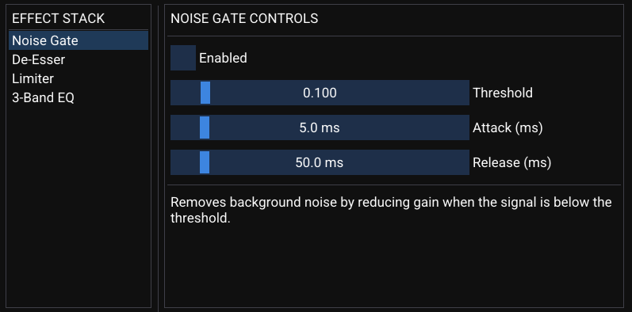

# multiaudio

**🎧Multithreaded Real-Time Audio Processor in C++**

---



---

## Program Usage

This project provides a **graphical user interface (GUI)** for adjusting live audio effects in real time.

Once the program is running, you can:
- Enable/disable the **Noise Gate**, **Limiter**, **3-Band EQ**, and **De-Esser**
- Adjust thresholds, gains, attack/release times, and de-essing parameters

Simply speak into your microphone to test the effects!

> **Note:** The previous text-based controls are now **defunct**. Use the GUI exclusively.

---

## Clone Repository

```bash
git clone --recurse-submodules https://github.com/pedicino/multiaudio.git
cd multiaudio
```

---

## Prerequisites

### Compiler Requirements

- A modern C++ compiler supporting C++11 or later:
  - **Linux:** GCC 7+ or Clang
  - **macOS:** Clang (Xcode Command Line Tools)
  - **Windows:** MSYS2 with MinGW-w64

### Required Libraries

- **RtAudio** (Audio input/output)
- **FFTW3** (Fast Fourier Transform)
- **GLFW** (Window and OpenGL context)
- **OpenGL** (Graphics rendering)
- **Dear ImGui** (GUI rendering)
- **Platform-specific audio and graphics libraries:**
  - **Linux:** `libasound2`, `libjack`
  - **macOS:** CoreAudio, CoreFoundation, Cocoa
  - **Windows:** winmm, ole32

---

## Dependency Installation

### Linux (Ubuntu/Debian)

```bash
sudo apt-get update
sudo apt-get install -y \
    build-essential \
    libfftw3-dev \
    librtaudio-dev \
    libglfw3-dev \
    libgl1-mesa-dev \
    libasound2-dev \
    libjack-dev
```

### macOS (using Homebrew)

```bash
# Install Homebrew (if not already installed)
/bin/bash -c "$(curl -fsSL https://raw.githubusercontent.com/Homebrew/install/HEAD/install.sh)"

# Install dependencies
brew install fftw rtaudio glfw
```

### Windows (using MSYS2)

1. Install MSYS2 from https://www.msys2.org/
2. Open the **MSYS2 MinGW 64-bit** terminal

```bash
# Update package database
pacman -Syu

# Install dependencies
pacman -S mingw-w64-x86_64-toolchain \
          mingw-w64-x86_64-fftw \
          mingw-w64-x86_64-rtaudio \
          mingw-w64-x86_64-glfw \
          mingw-w64-x86_64-opengl \
          mingw-w64-x86_64-cmake \
          mingw-w64-x86_64-winmm \
          mingw-w64-x86_64-ole32
```

---

## Compilation

### Linux

```bash
g++ -o multiaudio \
    main.cpp \
    audio/*.cpp \
    effects/*.cpp \
    gui/*.cpp \
    -lrtaudio -lfftw3 -lglfw -lGL -lpthread -lasound -ljack
```

### macOS

```bash
g++ -std=c++11 -o multiaudio \
    main.cpp \
    audio/*.cpp \
    effects/*.cpp \
    gui/*.cpp \
    -lrtaudio -lfftw3 -lglfw \
    -framework OpenGL -framework Cocoa -framework CoreAudio -framework CoreFoundation
```

### Windows (MSYS2 MinGW)

```bash
# Navigate to your project directory
cd /c/path/to/multiaudio

# Then build
bash build.bat
```

> **Note:** `build.bat` uses g++ to compile all source files and link the required libraries.

---

## Run

### Linux and macOS

```bash
./multiaudio
```

### Windows

```bash
./multiaudio.exe
```

When you launch the program, the GUI will open, allowing you to control and monitor live audio effects in real time.

---

## Configuration

- Adjust `SAMPLE_RATE`, `FRAMES_PER_BUFFER`, and `NUM_CHANNELS` in `common.h` if necessary.
- Tweak default effect parameters by editing the constructors in `main.cpp` before building.
